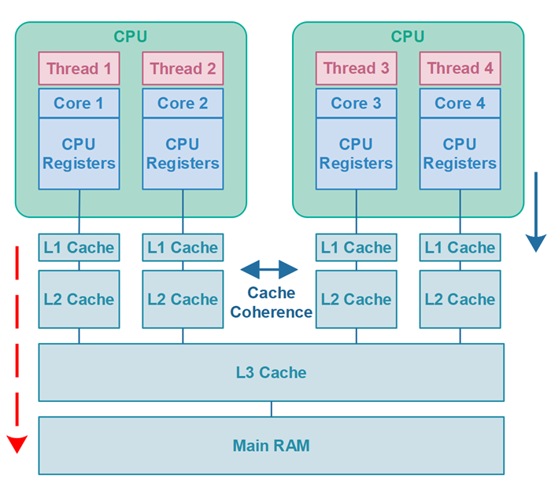

# [공유 중인 가변 데이터는 동기화해 사용하라]

## 동기화란??

`synchronized` 키워드를 통해, 해당 메서드나 블록을 한번에 한 스레드씩 수행하도록 보장하여 동기화할 수 있다.

1. 다른 스레드가 변경하는 중이라서 상태가 일관되지 않은 순간의 객체를 다른 스레드가 보지 못하게 막는다.
2. 동기화를 사용하면 해당 객체에 접근하는 메서드는 그 객체에 락(lock)을 걸어 객체의 상태를 일관된 상태로 유지하도록 한다.
3. 동기화는 일관성이 깨진 상태를 볼 수 없게 하는 것은 물론, 동기화된 메서드나 블록에 들어간 스레드가 같은 락의 보호하에 수행된 모든 이전 수정의 최종 결과를 보게 해준다.


## 동기화가 필요한 이유

- 언어 명세상 `long`과 `double` 외의 변수를 읽고 쓰는 동작은 원자적(atomic)이다.
- 원자적이라는 것은 여러 스레드가 같은 변수를 동기화 없이 수정하는 중이라도, 항상 어떤 스레드가 정상적으로 저장한 값을 온전히 읽어옴을 보장한다는 뜻이다.
- 그러나 자바에서 스레드가 필드를 읽을 때 항상 `수정이 완전히 반영된` 값을 얻는다고 보장하지만, 한 스레드가 저장한 값이 다른 스레드에게 `보이는가`는 보장하지 않는다.
- __동기화는 배타적 실행뿐 아니라 스레드 사이의 안정적인 통신에 꼭 필요하다.__


> ### 기본형 타입이 원자적인 이유
> JVM은 데이터를 4바이트(32비트) 단위로 처리한다.
> 1. int 보다 작은 타입 : 하나의 명령어로 처리되기 때문에, 한 스레드로만 처리된다(작업의 최소 단위).
> 2. long, double : 8 바이트를 넘어가기 때문에 여러 스레드가 개입될 여지가 생겨 원자적이라 할 수 없다.

```java
public class StopThread {
	private static boolean stopRequested;
    
    public static void main(String[] args) throws InterruptedException {
    	Thread backgroundThread = new Thread(() -> {
        	int i = 0;
            while (!stopRequested) {
            	i++;
            }
        });
        backgroundThread.start();
        
        TimeUnit.SECONDS.sleep(1);
        stopRequested = true;
    }
}
```

`stopRequested` 필드가 동기화가 되어 있지 않아, 수정된 값을 해당 스레드가 보는 것이 보장 되지 않기 때문에 무한 로프를 돌게 된다.

```java
while (!stopRequested) // 원래 코드
    i++;

if (!stopRequested)  // 최적화 코드 (끌어올리기) - 응답 불가 상태
	while (true)
    	i++;
```

JVM의 최적화된 코드에서 메인 스레드가 수정한 true 값이 반영되기 이전 그 짧은 시간 사이에 stopRequested 필드를 읽어와 버렸다면, if문이 이미 false 가 되었기 때문에 응답 불가 상태가 되기 때문이다.


## synchronized 사용

동기화를 통해 정상적으로 메인 스레드가 공유 필드를 읽고 수정한 값이 완벽히 반영된 이후에 다른 스레드가 값을 읽도록 허용한다면 문제를 해결할 수 있다.

```java
// 적절히 동기화해 스레드가 정상 종료한다.
public class StopThread {
	private static boolean stopRequested;
    
    private static synchronized void requestStop() { // 쓰기
        stopRequested = true;
    }

    private static synchronized boolean stopRequested() { // 읽기
        return stopRequested;
    }

    public static void main(String[] args) throws InterruptedException {
    	Thread backgroundThread = new Thread(() -> {
        	int i = 0;
            while (!stopRequested) {
            	i++;
            }
        });
        backgroundThread.start();
        
        TimeUnit.SECONDS.sleep(1);
        stopRequested = true;
    }
}
```

쓰기와 읽기 모두가 동기화 되지 않으면 동작을 보장하지 않는다.

위 코드의 두 메서드는 단순해서 동기화 없이도 원자적으로 동작한다.

동기화는 배타적 수행과 스레드 간 통신 두가지 기능을 수행하는데 위 코드는 통신 목적으로만 사용되었다.


## volatile 사용

`volatile` 키워드를 사용하면, `synchronized`보다 동기화 속도가 더 빨라지며 따로 쓰기와 읽기 동기화 메서드를 만들지 않아도 된다.


```java
// volatile 필드를 사용해 스레드가 정상 종료한다.
public class StopThread {
	private static volatile boolean stopRequested;

    public static void main(String[] args) throws InterruptedException {
    	Thread backgroundThread = new Thread(() -> {
        	int i = 0;
            while (!stopRequested) {
            	i++;
            }
        });
        backgroundThread.start();
        
        TimeUnit.SECONDS.sleep(1);
        stopRequested = true;
    }
}
```

`volatile`은 배타적 수행과는 상관없지만 항상 가장 최근에 기록된 값을 읽게 됨을 보장한다.

## volatile 개념

- `volatile` 이란, 공유 변수를 캐시가 아닌 메인 메모리에 저장하겠다라고 명시하는 키워드이다. 
- 참고로, 해당 키워드가 선언된 변수가 있는 코드는 최적화되지 않는다.



- CPU는 값에 대한 read/write 연산을 수행할 때 `L1 Cache`를 사용함으로 성능을 높인다.
- 하지만 멀티 스레딩 환경에서는 각 스레드마다의 Cache를 사용하기 때문에 값을 공유할 수 없다.

- 그렇기 때문에 Cache가 아닌, main memory에서 읽고 쓰는 연산을 하도록 도와주는게 `volatile`이다.
- volatile은 다른 스레드라도 같은 메모리 주소를 참조하게 해준다.


## volatile 한계

`volatile` 은 하나의 스레드만 쓰기/읽기 연산을 하고, 나머지 스레드들이 읽기 연산만을 하는 환경에서 사용하면 좋다.

그러나, `volatile`은 주의해서 사용해야 한다.

멀티 스레드 환경에서, 여러 스레드가 쓰기 연산을 수행할 경우에는 `volatile`이 적합하지 않다,
가시성(Visibility)는 해결해주지만, 상호배제(Mutual Exclusion) 문제는 해결할 수 없기 때문이다.

> 1. `Mutual Exclusion` : 하나의 코드 블록은 하나의 스레드 또는 프로세스만 실행할 수 있음
> 2. `Visibility` : 한 스레드가 공유데이터를 변경하면 다른 스레드에서도 볼 수 있음

```java
private static volatile int nextSerialNumber = 0;

public static int generateSerialNumber(){
    return nextSerialNumber++;
}
```

이 메서드는 매번 고유한 값을 반환할 의도로 만들어졌다. 

이 메서드의 상태는 `nextSerialNumber`라는 단 하나의 필드로 결정되는데, 원자적으로 접근할 수 있고 어떤 값이든 허용한다. 

따라서 굳이 동기화하지 않더라도 불변식을 보호할 수 있어보이지만 그렇지 않다.

문제는 증가 연산자 때문인데 코드상으로는 하나지만 실제로는 `nextSerialNumber` 필드에 두 번 접근한다.

### 오류 케이스
1. 먼저 값을 읽고, 새로운 값(+1) 을 저장한다.
2. 두번째 스레드가 이 두 접근 사이를 비집고 들어와 값을 읽어가면 첫 번째 스레드와 똑같은 값을 돌려받게 된다.
3. 결과적으로 1스레드 : `0 -> 1` , 2스레드 : `0 -> 1` 로 둘다 변수 `0`의 상태에서 `1`을 증가시켜 `2`가 아닌 `1`이 최종적으로 반영된다.
4. 프로그램이 잘못된 결과를 계산해내는 이런 오류를 안전 실패(safety failure)라고 한다.

`volatile`의 단점은 공유 블록에 한번에 하나의 스레드만 접근하는 것을 막지 못한다.


### 해결방안

1. 메서드에 `synchronized`를 붙였다면 `volatile`은 제거해야한다.
2. 이 메서드를 더 견고하게 하려면 `int` 대신 `long`을 사용하거나 `nextSerialNumer`가 최댓값에 도달하면 예외를 던지게 해야한다.

> 앞선 `StopThread` 예제에서 `volatile` 사용이 가능했던 이유는, 오직 스레드 하나만 `stopRequested` 공유 변수에 쓰기 연산을 하고 있었기 때문이다.


## 락-프리 안전한 클래스

`java.util.concurrent.atomic` 패키지의 `AtomicLong` 을 사용하면 멀티 스레딩 환경에서 락 없이도 안전하게 사용할 수 있다.

이 패키지는 락 없이도 (lock-free;락-프리) 스레드 안전한 프로그래밍을 지원하는 클래스들이 담겨 있다.

`volatile`은 동기화의 두 효과 중 통신 쪽만 지원하지만 이 패키지는 원자성(배타적 실행)까지 지원한다.

성능도 동기화 버전보다 우수하다.

```java
private static final AtomicLong nextNum = new AtomicLong();

public static long generateNumber() {
	return nextNum.getAndIncrement();
}
```


### 동기화를 잘쓰는 방법

1. 문제점을 파해하기 위한 가장 좋은 방법은 애초에 가변데이터를 공유하지 않는 것이다.
 - 불변 데이터만 공유하거나 아무것도 공유하지 말자.
 - __다시 말하면, 가변 데이터는 단일 스레드에서만 쓰도록 하자.__

2. 한 스레드가 데이터를 다 수정한 후 다른 스레드에 공유할 때는 해당 객체에서 공유하는 부분만 동기화해도 된다.
 - 그 객체를 다시 수정할 일이 생기기 전까지 다른 스레드들은 동기화 없이 자유롭게 값을 읽어갈 수 있다.
 - 이런 객체를 사실상 불변(effectively immutable)이라 하고 다른 스레드에 이런 객체를 건네는 행위를 안전 발행(safe publication)이라 한다.


이 외에도 객체를 안전하게 발행하는 방법은 많다.

클래스 초기화 과정에서 객체를 정적 필드, volatile 필드, final 필드, 혹은 보통의 락을 통해 접근하는 필드에 저장해도 된다.

그리고 동시에 컬렉션 (item 81)[../../11장/아이템_81/wait와_notify보다는_동시성_유틸리티를_애용하라.md] 에 저장하는 방법도 있다.


## 핵심정리
- 여러 스레드가 가변 데이터를 공유한다면, 데이터를 읽고 쓰는 동작 모두 반드시 동기화해야한다.
- 베타적 실행(여러 스레드의 동시 접근 제어)은 필요 없고 스레드끼리의 통신만 필요하다면(반영된 값 읽어오기) `volatile`만으로 동기화가 가능하나, 그게 아니라면 둘 다 지원하는 `synchronized`를 사용하자.