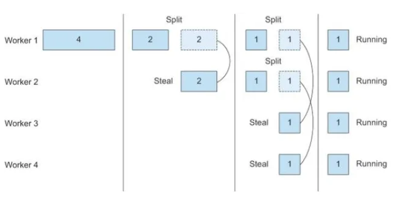
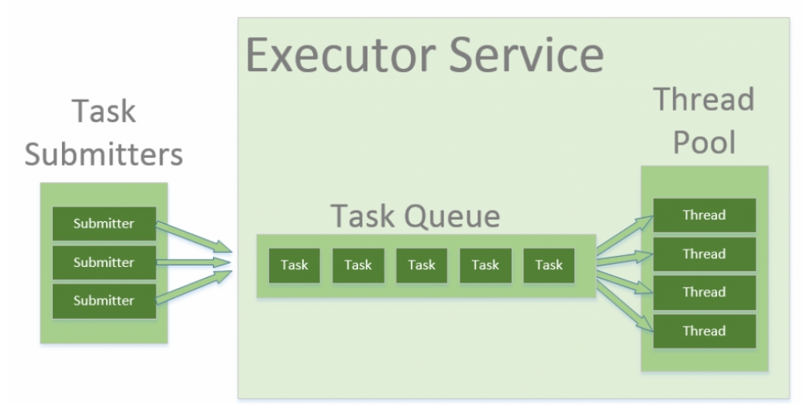

# [스레드보다는 실행자, 태스크, 스트림을 애용하자]

## 개요
[아이템 49](../../08장/아이템_49/매개변수가_유효한지_검사하라.md)에서 백그라운드 스레드에 위임해 비동기적으로 작업을 요청해 처리하는 작업 큐를 생성해 사용했었다.</br>
이제는 직접 사용자가 작업 큐를 작성하지 않고 java.util.concurrent 패키지를 사용하면 된다.</br>
실행자 프레임워크라고 하는 인터페이스 기반의 유연한 태스크 실행 기능을 담고 있다.</br>
아이템 49의 단순한 작업 큐(work queue) 보다 뛰어난 큐를 아래처럼 한 줄로 생성하고 사용할 수 있다.
```java
ExecutorService exec = Executors.newSingleThreadExecutor();    // 작업 큐 생성

exec.execute(runnable)  // 이 실행자에 실행할 task를 넘김

exec.shutdown();    // 실행자를 종료
```

## ExecutorService(실행자 서비스)의 주요 기능들
- 큐에 작업을 제출하고서 작업이 완료될 때까지 기다릴 수 있다.(invokeAny, invokeAll 메서드)
- 큐가 종료되기를 기다릴 수 있다.(awaitTermination 메서드)
- 하나의 작업이 끝날때 마다 작업의 결과를 가져올 수 있다.(ExecutorCompleteService)
- 작업을 특정 주기나 시간에 맞춰 동작할 수 있다.(ScheduledThreadPoolExecutor)

### 그 외 기능
- 큐를 둘 이상의 스레드가 처리하게 하고 싶다면 간단히 다른 정적 팩터리를 이용하여 다른 종류의 실행자 서비스(스레드 풀)를 생성하면 된다.
- 평범하지 않은 실행자를 원한다면 ThreadPoolExecutor 클래스를 직접 사용해도 된다. 이 클래스로는 스레드 풀 동작을 결정하는 거의 모든 속성을 설정할 수 있다.
- 작은 프로그램이나 가벼운 서버라면 Executors.newCachedThreadPool을 사용하라. 특별히 설정할 게 없고 일반적인 용도에 적합하게 동작한다.
- 무거운 프로덕션 서버에서는 스레드 개수를 고전한 Executors.newFixedThreadPool을 선택하거나 완전히 통제할 수 있는 ThreadPoolExecutor를 직접 사용하는 편이 훨씬 낫다.


### 주의사항
- 작업 큐를 직접 만들거나 스레드를 직접 다루는 것도 일반적으로 삼가야 한다.
- 스레드를 직접 다루지말고 실행자 프레임워크를 이용하자.
- 그러면 작업 단위와 실행 매커니즘을 분리할 수 있는다. 작업 단위는 Runnable과 Callable로 나눌 수 있다.
- Callable은 Runnable과 비슷하지만 값을 반환하고 임의의 예외를 던질 수 있다.
## 포크-조인(fork-join)
- 자바7부터 실행자 프레임워크는 포크-조인(fork-join) 태스크를 지원하도록 확장되었습니다.
- 포크-조인 태스크는 포크-조인 풀이라는 특별한 실행자 서비스가 실행해줍니다. ForkJoinTask의 인스턴스는 작은 하위 태스크로 나뉠 수 있고, ForkJoinPool을 구성하는 스레드들이 이 태스크들을 처리하며, 일을 먼저 끝낸 스레드는 다른 스레드의 남은 태스크를 가져와 대신 처리할 수도 있습니다.
- 이렇게 하여 최대한의 CPU 활용을 뽑아내어 높은 처리량과 낮은 지연시간을 달성한다.
- 병렬 스트림도 이러한 ForkJoinPool을 이용하여 구현되어 있다.

## 추가
- ForkJoinPool은 포크-조인 태스크를 실행하기 위한 풀입니다. 포크-조인 태스크는 분할 정복 알고리즘을 사용하여 작업을 병렬로 실행하는 데 사용되는 태스크입니다. ForkJoinPool은 포크-조인 태스크를 효율적으로 실행하기 위해 Work stealing 알고리즘을 사용합니다.
- ForkJoinThread는 포크-조인 태스크를 실행하기 위한 스레드입니다. ForkJoinThread는 ForkJoinPool에서 생성되며, ForkJoinPool의 Work stealing 알고리즘을 사용하여 포크-조인 태스크를 실행합니다.


### Work-stealing 알고리즘
- 작업을 잘게 나눌 수 있을 때까지 split 하고 작업 큐에 있는 tail task를 다른 쓰레드가 나누어 병렬처리한 후, join하여 합산하는 방식

- 기존 포크조인에서 사용
### 쓰레드 풀
- 스레드 제어 문제를 해결할 방법으로 스레드 풀을 사용한다. 스레드 풀은 매번 생성 및 수거 요청이 올 때 스레드를 생성하고 수거하는 것이 아닌, 스레드 사용자가 설정해둔 개수만큼 미리 생성해두는 것이다.


```java
import java.util.concurrent.ForkJoinPool;
import java.util.concurrent.ForkJoinTask;
import java.util.concurrent.RecursiveTask;

public class MyMain {

    public static void main(String[] args) throws Exception {
        // ForkJoinPool을 생성합니다.
        ForkJoinPool pool = ForkJoinPool.commonPool();

        // ForkJoinTask를 생성합니다.
        MyTask task = new MyTask(1, 1000000);

        // ForkJoinTask를 실행합니다.
        pool.submit(task);

        // ForkJoinTask가 완료될 때까지 대기합니다.
        task.join();

        // ForkJoinTask의 결과를 출력합니다.
        System.out.println(task.get());
    }
}

class MyTask extends RecursiveTask<Integer> {

    private int start;
    private int end;

    public MyTask(int start, int end) {
        this.start = start;
        this.end = end;
    }

    @Override
    protected Integer compute() {
        // 작업의 크기가 10 미만이면 직접 계산합니다.
        if (end - start <= 10) {
            int sum = 0;
            for (int i = start; i < end; i++) {
                sum += i;
            }
            return sum;
        }

        // 작업을 두 개의 더 작은 작업으로 분할합니다.
        int mid = (start + end) / 2;
        MyTask leftTask = new MyTask(start, mid);
        MyTask rightTask = new MyTask(mid, end);

        // 분할된 작업을 실행합니다.
        leftTask.fork();
        rightTask.fork();

        // 분할된 작업의 결과를 합산합니다.
        return leftTask.join() + rightTask.join();
    }
}
```
- pool.submit() 메서드는 작업을 포크-조인 풀에 제출합니다. 포크-조인 풀은 작업을 실행할 스레드를 선택하고 선택한 스레드에 작업을 할당합니다. 따라서 pool.submit() 메서드를 호출하면 작업이 자동으로 실행됩니다.
