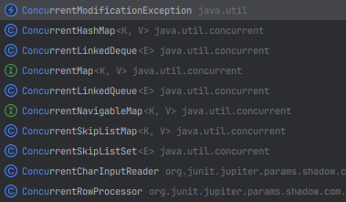

# [wait와 notify보다는 동시성 유틸리티를 애용하라]

스레드를 다루는 메서드 중 wait()와 notify()를 올바르게 사용하는 방법이 있다.

- wait()는 스레드가 일시정지 상태로 돌아가는 메서드
- notify()는 일시정지 상태인 스레드 중 하나를 실행대기 상태로 만드는 메서드
- notifyAll()은 일시정지 상태인 스레드 모두를 실행대기 상태로 만드는 메서드

하지만 자바5부터 도입된 동시성 유틸리티(concurrent)가 이 작업들을 대신해주기 때문에  사실 사용할 일이 거의 없다.

__wait와 notify는 올바르게 사용하기가 아주 까다로우니 고수준 동시성 유틸리티를 사용하자__

`java.util.concurrent`의 고수준 유틸리티는 세범주로 나눌 수 있다.
1. 실행자 프레임워크 [(item 80)](11장/아이템_80/스레드보다는_실행자,태스크,스트림을_애용하자.md)
2. 동시성 컬렉션(concurrent collection)
3. 동기화 장치(synchronizer)

이 중 동시성컬렉션과 동기화 장치를 살펴본다.

## 동시성 컬렉션 - Map

기본 컬렉션에 동시성을 만족하도록 구현한 컬렉션을 말한다.




### Map
- HashMap : 동시성을 고려하지 않음
- HashTable : 동시성을 고려하지만 메서드 단위이기 때문에 느릴 수 있음
- ConcurrentHashMap : 동시성을 고려하며 메서드를 한번에 동기화 처리하는 HashTable 보다 빠르다.

```java
void concurrency() throws InterruptedException {
    ExecutorService exec = Executors.newFixedThreadPool(3);
    Map<Integer, Integer> hashMap = new HashMap<>();
    Map<Integer, Integer> hashTable = new Hashtable<>();
    Map<Integer, Integer> concurrentHashMap = new ConcurrentHashMap<>();

    for (int i = 0; i < 1000; i++) {
        exec.execute(() -> {
            for (int j = 0; j < 1000; j++) {
                hashMap.put(j, 1);
                hashTable.put(j, 1);
                concurrentHashMap.put(j, 1);
            }
        });
    }
    exec.shutdown();

    while (!exec.isTerminated()) {
        Thread.sleep(1000);
    }

    System.out.println("HashMap: " + hashMap.size()); // 1016
    System.out.println("HashTable: " + hashTable.size()); //1000
    System.out.println("ConcurrentHashMap: " + concurrentHashMap.size()); // 1000
}
```

`HashTable`과 `ConcurrentHashMap`은 `put`메서드에 대해 동시성을 지원한다.

따라서 실행자가 1000번의 동시수행을 시도해도 key 값이 1-1000으로 고정되어있기 때문에 항상 size 1000을 보장한다.

하지만 `HashMap`은 스레드세이프하지 않기 때문에 size가 1000이 넘는 경우가 발생한다.

물론 내부를 수행해보면 key 는 1-1000로 동일한데 실제 `Map`에 key를 `put`하기 전에 size를 증가시키기 때문에 이와 같은 현상이 발생하는 것이다.

__동시성 컬렉션은 동기화를 무력화하지 못한다. 동기화가 필요 없다면 기존 컬렉션을 사용하면 된다. 만약 외부에서 락을 추가로 사용하면 오히려 속도가 느려진다.__

동시성 컬렉션에서 동시성을 무력화하지 못하기 때문에 여러 메서드를 원자적으로 호출하는 것이 불가능한데, 이런 것들을 지원하는 기본 메서드들이 생겼다.

예를 들어, `map`의 `putIfAbsent(key,value)`메서드는 주어진 키에 매핑된 값이 아직 없을 때만 새 값을 집어 넣는다. 그리고 기존 값이 있었다면 그 값을 반환하고, 없었다면 null을 반환한다.

이 메서드 덕에 스레드 안전한 `정규화 맵(canonicalizing map)`을 쉽게 구현할 수 있다.


다음은 `String.intern` 동작을 흉내낸 코드이다.

```java
//ConcurrentMap으로 구현한 동시성 정규화 맵 - 최적은 아니다.
private static final ConcurrnetHashMap<String, String> map = new ConcurrentHashMap<>()

public static String intern(String s){
    String previousValue = map.putIfAbsent(s, s);
    return previousValue == null ? s : previousValue;
}

```
- `ConcurrentHashMap`은 `get`같은 검색 기능에 최적화되어 있기 때문에 이를 이용하면 더 빠르게 개선할 수 있다.

```java
// ConcurrentMap으로 구현한 동시성 정규화 맵 - 더 빠르다!
public static String intern(String s){
	String result = map.get(s);
    if(result == null){
    	result = map.putIfAbsent(s, s);
        if (result == null)
        	result = s;
    }
    return result;
}
```

- 동시성 컬렉션은 동기화한 컬렉션을 낡은 유산으로 만들었다. `Collections.synchronizedMap` 보다는 `ConcurrentHashMap`을 사용하는게 훨씬 낫다.


## 동기화 장치

`BlockingQueue`는 `Queue`를 확장한 컬렉션이다.

추가된 메서드 중 `take`가 있다.

1. 큐의 첫 원소를 꺼낸다.
2. 이때 만약 큐가 비어있다면 새로운 원소가 추가될 때까지 기다린다.

이런 특성 덕분에 작업 큐(생산자 - 소비자 큐)로 쓰기에 적합하다.

동기화 장치는 스레드가 다른 스레드를 기다릴 수 있게 해 서로의 작업을 조율할 수 있도록 해준다.

가장 자주 쓰이는 동기화 장치는 `CountDownLatch`와 `Semaphore`다. 그리고 가장 강력한 동기화 장치는 `Phaser`이다.

## CountDownLatch (Latch : 걸쇠)

`CountDownLatch`는 일회성 장벽으로, 하나 이상의 스레드가 다른 하나 이상의 스레드 작업이 끝날때까지 기다리게 한다. `CountDownLatch`의 유일한 생성자는 `int`값을 받으며, 이 값을 `CountDown`메서드를 몇번 호출해야 대기 중인 스레드들을 깨울지를 결정한다.

다음은 `CountDownLatch`를 활용해 시간을 재는 프레임워크를 구축하는 예시이다.

```java
// 동시 실행 시간을 재는 간단한 프레임워크
public static long time(Executor executor, int concurrency, 
			Runnable action) throws InturruptedException {
	
    CountDownLatch ready = new CountDownLatch(concurrenycy);
    CountDownLatch start = new CountDownLatch(1);
    CountDownLatch done = new CountDownLatch(concurrency);

	for (int i = 0; i < concurrency; i++) {
    	executor.execute(() -> {
        	// 타이머에게 준비를 마쳤음을 알린다.
            ready.countDown();
            try {
            	// 모든 작업자 스레드가 준비될 때까지 기다린다.
                start.await();
                action.run();
            } catch (InturruptedException e){
            	Thread.currentThread().interrupt();
            } finally {
            	// 타이머에게 작업을 마쳤음을 알린다.
                done.countDown();
            }
        });
    }
    
    ready.await(); // 모든 작업자가 준비될 때까지 기다린다.
    long startNanos = System.nanoTime();
    start.countDown(); // 작업자들을 깨운다.
    done.await(); // 모든 작업자가 일을 끝마치기를 기다린다.
    return System.nanoTime() - startNanos;
}
```
### 동작 순서
1. `ready`래치는 작업자 스레드들이 준비가 완료됐음을 타이머 스레드에게 통지할 때 사용한다. 통지를 끝낸 작업자 스레드들은 두 번째 래치인 `start`가 열리기를 기다린다.
2. 마지막 작업자 스레드가 `ready.countDown`을 호출하면 타이머 스레드가 시작 시각을 기록하고 `start.countDown()`을 호출해 기다리던 작업자 스레드들을 깨운다. 그 직후 타이머 스레드는 세 번째 래치인 `done`이 열리기를 기다린다.
3. `done`래치는 마지막 남은 작업자 스레드가 동작을 마치고 `done.countDown`을 호출하면 열린다. 타이머 스레드를 `done` 래치가 열리자마자 깨어나 종료 시각을 기록한다.


### 추가 세부사항
`time`메서드에 넘겨진 실행자는 `concurrency`매개변수로 지정한 동시성 수준만큼의 스레드를 생성할 수 있어야 한다. 그렇지 못하면 이 메서드는 영원히 끝나지 않는다. 

스레드의 수가 `concurrency`보다 적어 스레드들은 영원히 대기하게 되기 때문이다. 이런 상태를 `스레드 기아 교착상태 (thread starvation deadlock)`이라고 한다.


## wait 과 notify
새로운 코드라면 `wait`과 `notify`대신 동시성 유틸리티를 사용해야 한다. 하지만 레거시를 다뤄야 할 때도 있을 것이다.

```java
// wait 메서드를 사용하는 표준 방식
synchronized (obj) {
	while(<조건이 충족되지 않았다>)
    	obj.wait(); // 락을 놓고, 깨어나면 다시 잡는다.
	
    ... // 조건이 충족되면 동작을 수행한다.
}
```
> `wait` 메서드를 사용할 때는 반드시 `대기 반복문(wait loop)`관용구를 사용하라. 반복문 바깥에서는 절대 호출하지 말아야 한다. 이 구문은 `wait`호출 전 후로 조건이 만족되었는지 확인한다.

대기 전에 조건을 검사해 조건이 이미 충족되었다면 `wait`를 건너뛰게 하는 것은 응답 불가 상태를 예방하는 조치다. 

만약 조건이 충족되었는데 스레드가 `notify` 메서드를 호출하고 대기 상태로 빠지면, 그 스레드를 다시 깨울 수 있다고 보장할 수 없다.


### 조건이 만족되지 않아도 스레드가 깨어날 몇가지 상황들

- 스레드가 `notify`를 호출하고 대기중이던 스레드가 깨어나는 사이 다른 스레드가 락을 얻어 그 락이 보호하는 상태를 변경한다.
- 조건이 만족되지 않았음에도 다른 스레드가 실수로 혹은 악의로 `notify`를 호출한다.
- 깨우는 스레드가 지나치게 관대해 일부 조건만 만족했는데도 `notifyAll`을 호출하는 경우
- 대기 중인 스레드가 드물게 `notify` 없이도 깨어나는 경우 (허위 각성 현상, spurious wakeup)


## notify 대신 notifyAll
일반적으로는 `notify`보다는 `notifyAll`을 호출하는 것이 합리적이고 안전한 조언이 된다.

- `notifyAll`은 관련 없는 스레드가 실수로 혹은 악의로 `wait`를 호출하는 공격으로 보호할 수 있다.
- 깨어나야 하지만 깨어나지 못한 스레드들을 깨울 수 있다. 다른 스레드가 깨워질수 있지만, 조건이 만족되지 않았다면 그 스레드들은 다시 대기할 것이다.

모든 스레드가 같은 조건을 기다리고, 조건이 한 번 충족될때마다 하나의 스레드만 깨우는 경우라면 최적화 하기 위한 용도로 `notify`를 사용해도 된다.


## 핵심 정리
- 코드를 새로 작성한다면 `notify`와 `wait`를 사용할 이유가 거의 없다. 
- 하지만 이들을 유지보수해야 한다면 wait은 항상 표준 관용구에 따라 while문 안에서 호출하도록 하고 `notify`보다는 `notifyAll`을 사용해야 한다.
- 혹시라도 `notify`를 사용한다면 응답 불가 상태에 빠지지 않도록 각별하게 주의하자.