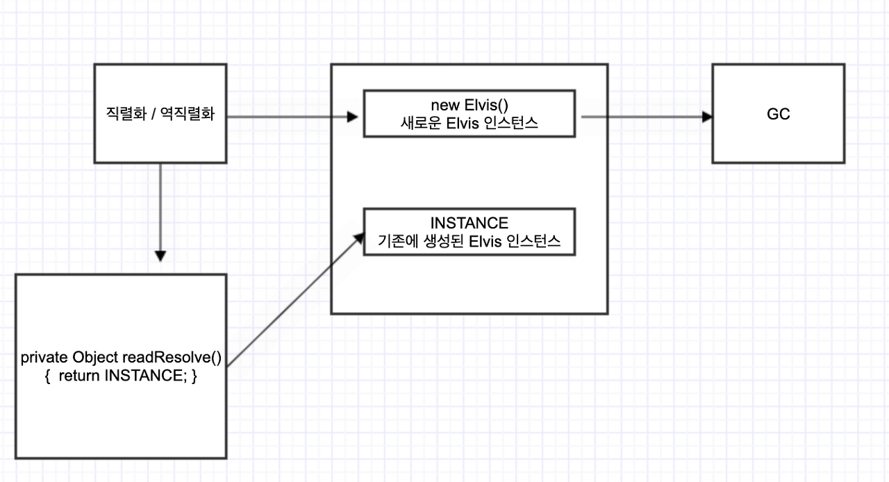

# [인스턴스 수를 통제해야 한다면 readResolve 보다는 열거 타입을 사용하라]

## 자바 직렬화란?
- 자바로 구현된 시스템 간에 데이터를 주고 받는 방법으로 자바 직렬화가 있다.
- 직렬화하고 싶은 클래스에 Serializable 인터페이스만 구현(implements)해주면 직렬화 가능한 클래스가 된다. 클래스에서 transient 또는 static 키워드가 선언된 필드를 제외하고는 모두 직렬화 대상이 된다.
- 클래스에서 `transient` 또는 `static`키워드가 선언된 필드를 제외하고는 모두 직렬화 대상이 된다.


```java
/**
 * 직렬화 가능 클래스
 * @author madplay
 */
public class Article implements Serializable {
	private transient Integer id; // 직렬화 대상에서 제외한다.
	private String title;
	private String pressName;
	private String reporterName;

	public Article(Integer id, String title, String pressName, String reporterName) {
		this.id = id;
		this.title = title;
		this.pressName = pressName;
		this.reporterName = reporterName;
	}

    /**
     * 멤버 필드 확인 용도로 재정의한다.
     */
	@Override
	public String toString() {
		return String.format("id = %s, title = %s, pressName = %s, reporterName = %s",
			id, title, pressName, reporterName);
	}
}
```
```
id = null, title = 테스트, pressName = 테스트, reporterName = 테스트
```

## 싱글턴과 직렬화
싱글턴으로 구현된 클래스는 인스턴스를 하나만 만들어지는 것을 보장한다.

```java
//싱글턴 패턴
public class Elvis {
    public static final Elvis INSTANCE = new Elvis();
    private Elvis() { }

    public void leaveTheBuilding(){...}
}
```
- 바깥에서 생성자를 호출하지 못하게 막아 인스턴스가 1개만 만들어짐을 보장한다.


### 싱글턴 클래스 직렬화 문제
- `Elvis` 코드에 `implements Serializable`을 추가하는 순간 더이상 싱글턴이 아니게 된다.
- 기본 직렬화를 쓰지 않더라도[(item 87)](../../12장/아이템_87/커스텀_직렬화_형태를_고려해보라.md), 명시적인 `readObject`를 제공하더라도[(item 88)](../../12장/아이템_88/readObject_메서드는_방어적으로_작성하라.md) 소용이 없으며 어떤 `readObject`를 사용하든 이 클래스가 초기화 될 때 만들어진 인스턴스와는 별개인 인스턴스를 반환하게 된다.
- 실제 싱글턴 인스턴스를 직렬화/역직렬화 하면 `==` 연산자와 `equals` 연산자가 `false`가 나오는 것을 확인할 수 있다.


### 싱글턴 클래스 직렬화 문제 해결
- `readResolve` 메서드를 통해, 기존 객체의 참조를 반환하면 된다.
- `readResolve` 메서드는 역직렬화 중에 생성된 객체를 다른 객체로 대체하는데 사용된다.
- 따라서 만일 역직렬화 과정에서 자동으로 호출되는 `readObject` 메서드가 있더라도 `readResolve` 메서드에서 반환한 인스턴스로 대체되기 때문에, `readObject` 메서드를 통해 만들어진 인스턴스는 더이상 유지되지 않아 가비지 컬렉션 대상이 되어 사라져 싱글톤을 보장할 수 있다.


### readResolve 기능을 이용하는 경우
- `readResolve`메서드를 이용하면 `readObject`메서드가 만든 인스턴스를 다른 것으로 대체할 수 있다.
- 즉, 역직렬화 과정에서 만들어진 인스턴스 대신에 기존에 생성된 싱글턴 인스턴스를 반환하게 한다.
- 실제로 역직렬화 과정에서 자동으로 호출되는 `readObject`메서드가 있더라도 `readResolve`메서드에서 반환한 인스턴스로 대체된다.
- `readObject`가 만들어낸 인스턴스는 가비지 컬렉션의 대상이 된다.
- 그 후 `==`연산자와 `equals`메서드로 비교하면 `true`가 뜬다.




```java
//인스턴스 통제를 위한 readResolve - 개선의 여지가 있다!
private Object readResolve() {
    // 진짜 Elvis를 반환하고, 가짜 Elvis는 가비지 컬렉터에 맡긴다.
    return INSTANCE;
}

```
앞의 `Elvis` 클래스가 `Serializable을` 구현한다면 다음의 `readResolve` 메서드를 추가해 싱글턴이라는 속성을 유지할 수 있다.

- 이 메서드는 역직렬화한 객체는 무시하고 클래스 초기화 때 만들어진 `Elvis`인스턴스를 반환한다.
- 따라서 `Elvis` 인스턴스의 직렬화 형태는 아무런 실 데이터를 가질 이유가 없으니 모든 인스턴스 필드를 `transient로` 선언해야 한다.
- 사실, `readResolve` 를 인스턴스 통제 목적으로 사용한다면 객체 참조타입 인스턴스 필드는 모두 `transient` 로 선언해야 한다.
- 그렇지 않으면 [(아이템 88)](../../12장/아이템_88/readObject_메서드는_방어적으로_작성하라.md) 에서 살펴본 `MutablePeriod` 공격과 비슷한 방식으로 `readResolve` 메서드가 수행되기 전에 역직렬화된 객체의 참조를 공격할 여지가 남는다.


### Transient
- 객체의 필드 중에 직렬화 하지 않을 것들을 지정하기 위해 사용한다.
- 비밀번호 암호등의 민감한 정보가 그 예시다.


#### 보안

- `readResolve`를 인스턴스 통제 목적으로 사용한다면 객체 참조 타입 인스턴스 필드는 모두 `transient`로 선언하자.
- 이렇게 하지 않으면 역직렬화된 객체 참조를 공격할 여지가 남는다.


1. `readResolve` 메서드와 인스턴스 필드 하나를 포함한 도둑 클래스를 만든다.
2. 도둑 클래스의 인스턴스 필드는 직렬화된 싱글턴을 참조하는 역할을 한다.
3. 직렬화된 스트림에서 싱글턴의 비휘발성 필드를 도둑의 인스턴스 필드로 교체한다.
4. 싱글턴이 도둑을 포함하므로 역직렬화시 도둑 클래스의 `readResolve` 가 먼저 호출된다.
5. 도둑 클래스의 인스턴스 필드에는 역직렬화 도중의 싱글턴의 참조가 담겨있게 된다.
6. 도둑 클래스의 `readResolve` 메서드는 인스턴스 필드가 참조한 값을 정적 필드로 복사한다.
7. 싱글턴은 도둑이 숨긴 `transient` 가 아닌 필드의 원래 타입에 맞는 값을 반환한다.
8. 이 과정을 생략하면 직렬화 시스템이 도둑의 참조를 이 필드에 저장하려 할 때 `ClassCastException` 이 발생한다.

```java
//잘못된 싱글턴 - tranient가 아닌 참조 필드를 가지는 싱글턴
public class Elvis implements Serializable {
    public static final Elvis INSTANCE = new Elvis();
    private Elvis() { }

    private String[] favoriteSongs = {"Hound Dog", "Heartbreak Hotel"};

    public void printFavorites() {
        System.out.println(Arrays.toString(favoriteSongs));
    }

    private Object readResolve() {
        return INSTANCE;
    }
}
```

```java
// 싱글턴의 비휘발성 인스턴스 필드를 훔쳐러는 도둑 클래스
public class ElvisStealer implements Serializable {
    static Elvis impersonator;
    private Elvis payload;

    private Object readResolve() {
        // resolve되기 전의 Elvis 인스턴스의 참조를 저장한다.
        impersonator = payload;
        // favoriteSongs 필드에 맞는 타입의 객체를 반환한다.
        return new String[] {"There is no cow level"};
    }
    private static final long serialVersionUID = 0;

}
```

```java
// 직렬화의 약점(허점)을 이용해 싱글턴 객체를 2개 생성한다.
public class ElvisImpersonator {
    private static final byte[] serializedForm = new byte[]{
        (byte) 0xac, (byte) 0xed, 0x00, 0x05, 0x73, 0x72, 0x00, 0x05,
        // 코드 생략
    };

    private static Object deserialize(byte[] sf) {
        try (ByteArrayInputStream byteArrayInputStream = new ByteArrayInputStream(sf)) {
        try (ObjectInputStream objectInputStream = new ObjectInputStream(byteArrayInputStream)) {
            return objectInputStream.readObject();
        } catch (IOException | ClassNotFoundException e) {
            throw new IllegalArgumentException(e);
        }
        }
    }

    public static void main(String[] args) {
        // ElvisStealer.impersonator 를 초기화한 다음,
        // 진짜 Elvis(즉, Elvis.INSTANCE)를 반환
        Elvis elvis = (Elvis) deserialize(serializedForm);
        Elvis impersonator = ElvisStealer.impersonator;
        elvis.printFavorites(); // [Hound Dog, Heartbreak Hotel]
        impersonator.printFavorites(); // [There is no cow level]
    }
}
```

```
[Hound Dog, Heartbreak Hotel]
[There is no cow level]
```


## Enum 사용

- `enum` 을 사용하면 모든것이 해결된다.
- 자바가 선언한 상수 외에 다른 객체가 없음을 보장해주기 때문이다.
- `AccessibleObject.setAccessible` 메서드와 같은 리플렉션을 사용했을 때는 예외다.

```java
public enum Elvis {
    INSTANCE;

    private String[] favoriteSongs = {"Hound Dog", "Heartbreak Hotel"};

    public void printFavorites() {
        System.out.println(Arrays.toString(favoriteSongs));
    }
}
```
- 인스턴스 통제를 위해 `readResolve` 메서드를 사용하는 것이 중요할 때도 있다.
- 직렬화 가능 인스턴스 통제 클래스를 작성해야 할 때, 컴파일 타임에는 어떤 인스턴스들이 있는지 모를 수 있는 상황이라면 열거 타입으로 표현하는 것이 불가능하기 때문에 `readResolve` 메서드를 사용할 수 밖에 없다.


## readResolve 메서드의 접근성 (매우중요함!)
1. private : final 클래스인 경우 사용 (하위 클래스에서 사용할 수 없다.)
2. package-private : 같은 패키지에 속한 하위 클래스만 사용 가능
3. protected / public : 모든 하위 클래스에서 사용 가능하지만, 하위클래스에서 재정의 하지 않는 경우 하위 클래스의 인스턴스를 역직렬화하면 상위 클래스의 인스턴스를 생성해 `ClassCastException`을 일으킬 수 있다.


## 핵심정리
- 불변식을 지키기 위해 인스턴스를 통제해야 한다면 가능한 한 열거 타입을 사용하자.
- 여의치 않은 상황에서 직렬화와 인스턴스 통제가 모두 필요하다면 readResolve 메서드를 작성해 넣어야 하고, 그 클래스에서 모든 참조 타입 인스턴스 필드를 transient로 선언해야 한다.